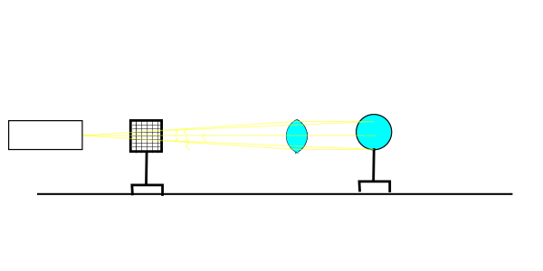
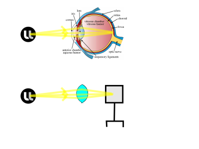
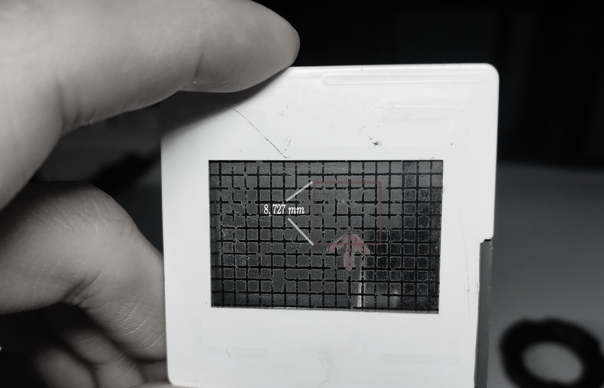
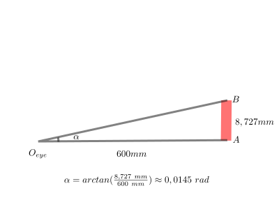
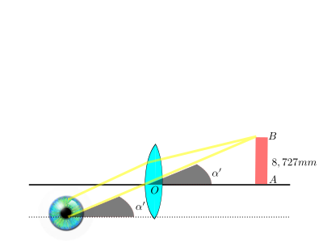
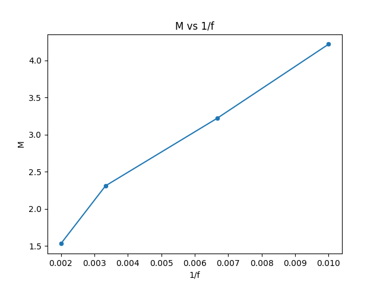

# TP3: Modelling the Human Eye

## Introduction

The human eye is probably one of the finest construction of nature. Equipped with a lens capable of changing focal distance from about 250mm to infinity with the aid of the rectus muscles, our eye perceives things from far just like from close-up. In this experiment, we seek to reconstruct the human eye with an optical bench to better understand the function of the human eye from an optical physics perspective, notably how the eye is able to adjust itself to focus on objects close-up and far away.

## Experimental setup

For this experiment, we employ the following equipments:

1. an optical bench with graduations
2. a point light source emitting diverging light rays
3. a transparent gridded glass serving as object
4. converging lenses with nominal focal distances at 10, 15 and 20 cm
5. a blank screen
6. various mounts to affixate the optical equipments to the bench

## Experimental procedure

1. Verification of actual focal distances of converging lenses by autocollimation

First, we verify the focal distances of the converging lenses to be employed in our experiment with the following setup:



We obtained the following results:

nominal focal distance (mm),100,150,200
measured focal distance (mm),104,155,208

2. Construction of a fictional eye

We construct a fictional eye with a converging lense, which represents the lens in the eye, and a blank screen, which represents the retina:



2.1 We then construct a scenario simulating the focus on an object considered infinitely far (light rays arriving in parallel):


2.2 We then construct a scenario simulating the focus on an object 200 mm away from the eye:


With the Descarte's law($\frac{1}{\overrightarrow{AO}} + \frac{1}{\overrightarrow{OA'}} = \frac{1}{\overrightarrow{OF'}}$), we calculated the new focal distance required to obtain a clear image on the "retina" to be 104 mm, which is experimentally verified as a clear image is obtained when we replaced the converging lens of a nominal focal distance of 200mm ("eye lens") with a converging lens of a nominal focal distance of 100mm.

3. Experimentation with magnifying glasses to understand the mechanism of optical magnification

After having constructed the fictive eye and understood its optical mechanisms, we now with the aid of converging lenses (which serves as magnifying glasses) attempt to understand the mechanisms of optical magnification.

The experiemental set up is as follows:


Hence we have $O_{eye}A=600mm$ (arbitrary choice), eye focused on infinity (simulated with converging lens of $f_{nominal}=200\ mm$).

With the aid of a ruler, we have measured the size of 11 vertical grids of the gridded glass to be 24mm, which translates into an average of 2.182 mm per grid.
For convenience, we isolate the four grids above the focal centre, which has a theoretical height of 8.727 mm as our object ($AB=8.727\ mm$):



This translates to an observation angle $\alpha$ of approximately 0.0145 radians:



To observe the magnification effect, we place converging lenses of various focal length between the "eye lens" and the object $AB$, moving them around until a clear image is obtained. We note this position as $O$. $AB$ designates the object (4 vertical grids), and $A"B"$ designates the image projected onto the "retina".

Since the eye is focused at infinity, the light rays arriving at the "eye lens" must be parallel to form a clear image on the "retina". Therefore, $\alpha'=\arctan(\frac{AB}{AO})$. So the magnification magnitude $M=\frac{\alpha'}{\alpha}=\frac{\arctan(\frac{AB}{AO})}{0.0145 rad}$:



Experimentally we have obtained the following measurements:

Nominal focal distance $f$ (mm),100,150,300,500
$OA$ (mm),142,186,260,392
$A"B"$ (mm),9.0,7.7,6.0,5.0
$\frac{A"B"}{AB}$ (calculated),1.03128222756961,0.88231923914289,0.687521485046408,0.572934570872006
$M$ (calculated),4.22,3.22,2.31,1.53
$\frac{M}{\frac{A"B"}{AB}}$,4.09232584228233,3.65363291506442,3.35551635332181,2.67127854210275

From which we can attest that the human eye lens "shrinks" images before passing them to the retina. As we noticed the field of vision (which is represented by the number of visible grids on the screen) is increasingly limited with higher magnifying magnitudes, we infer that this is by design to preserve the field of vision while we look at objects way larger than our eye !

In addition, graphing $M$ against $\frac{1}{f}$:



We witness a near-linear relationship between the two as expected.

## Conclusion

In this experiment, we reconstructed a human eye with optical geometric analogs to understand how a human eye is able to focus on objects of different distances. We then placed converging lens of various focal lengths in front of our physical analog eye to understand the fonctionning of the magnifying glasses. Our experimental results concur with theoretical derivations.

## Bibliography


## Appendix

Python code used to graph $M$ against $\frac{1}{f}$:

```python
import seaborn as sns
import matplotlib.pyplot as plt
import pandas as pd

# Your data (converted to proper floats)
data = pd.DataFrame({
    "inv_f": [0.01, 0.00666666666666667, 0.00333333333333333, 0.002],
    "M": [4.22, 3.22, 2.31, 1.53]
})

# Plot
sns.scatterplot(data=data, x="inv_f", y="M")

# Optional: add line
sns.lineplot(data=data, x="inv_f", y="M")

plt.xlabel("1/f")
plt.ylabel("M")
plt.title("M vs 1/f")
plt.show()
```

